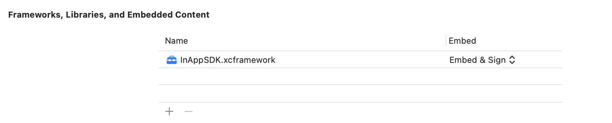
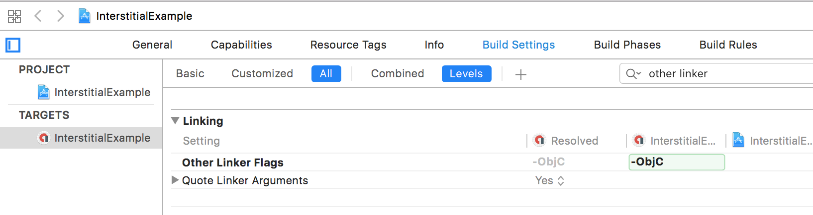

# Integrate the SDK

This document describe how to integrate the InApp iOS SDK into your iOS project.

## 1. Integrate with CocoaPods (preffered)

The simplest way to use InApp SDK is to integrate with [CocoaPods](https://guides.cocoapods.org/using/getting-started).

If you're new to CocoaPods, see their [official documentation](https://guides.cocoapods.org/using/using-cocoapods) for information on how to create and use Pod files.

Follow the steps below to integrate with CocoaPods:

1. Ensure you have a `podfile` in your project. If you don't have one:

	a) Open Terminal or your command line tool.
	
	b) Navigate to the location of your project's `.xcodeproj` file (by `cd` command).

	c) Enter the following command:

	```
	pod init
	```

	d) Verify that a file named `Podfile` was created in the current location.

2. Add your `InAppSDK` pod in your `Podfile`:

```
target 'ExampleProject' do
  use_frameworks!

  # Pods for ExampleProject
  pod 'InAppSDK'

  ...
end
```

3. Run the following command to install dependencies:

```
pod install --repo-update
```

This will create a `Pods` subdirectory containing the dependencies in the same location as `Podfile` and `.xcworkspace` file used for opening your app project with linked dependencies. 


Add our pod in your Podfile:

```swift
pod 'InAppSDK'
```

Then, from the command line run:

```swift
pod install --repo-update
```

## 2. Integrate Manually.

Alternatively, you can manually import the SDK with the following steps:

1. Download [zip archive](https://sdk.brainlyads.com/ios/repository/1.2.8/InAppSDK.zip) with `.xcframework` of the SDK.

2. Unzip the file to your Xcode project's directory (i.e., drag and drop it to your project’s directory).

3. Integrate `Google Mobile Ads SDK` as described in [Google's quickstart guide](https://developers.google.com/admob/ios/quick-start). Google Mobile Ads is required for the InApp iOS SDK to work correctly. 

4. Navigate to the **General** tab of your Xcode project and locate the **Frameworks, Libraries, and Embedded Content** section.

5. Ensure that `InAppSDK.xcframework` added in this section and **Embed** is set to **Embed & Sign**.



# Configure your Xcode Project

Configure the following settings in your Xcode project:

### Add -ObjC linker flag

1. Open your project's settings and navigate to your project's main target.

2. Navigate to the **Build Setting** tab and locate the **Other Linker Flags** section.

3. Add the `-ObjC` linker flag:



### Update info.plist of app

Add the following to your project's `info.plist` file.

**Note**: If you’re unfamiliar with Xcode’s `info.plist` file, learn more at [Apple Developer docs](https://developer.apple.com/documentation/bundleresources/information_property_list).

- Your unique InApp API, provided by your Next Millennium Media contact:

```xml
<key>InAppSDKAPIKey</key>
<string>Put your API Key here</string>
```

- Your unique Google App ID, provided by your Next Millennium Media contact:

```xml
<key>GADApplicationIdentifier</key>
<string>Google App ID</string>
```

- Add a `SKAdNetworkItems` key with the following collection of `SKAdNetworkIdentifier` key/value pairs:


```xml
<key>SKAdNetworkItems</key>
	<array>
		<dict>
			<key>SKAdNetworkIdentifier</key>
			<string>k674qkevps.skadnetwork</string>
		</dict>
		<dict>
			<key>SKAdNetworkIdentifier</key>
			<string>7ug5zh24hu.skadnetwork</string>
		</dict>
		<dict>
			<key>SKAdNetworkIdentifier</key>
			<string>uw77j35x4d.skadnetwork</string>
		</dict>
		<dict>
			<key>SKAdNetworkIdentifier</key>
			<string>c6k4g5qg8m.skadnetwork</string>
		</dict>
		<dict>
			<key>SKAdNetworkIdentifier</key>
			<string>hs6bdukanm.skadnetwork</string>
		</dict>
		<dict>
			<key>SKAdNetworkIdentifier</key>
			<string>yclnxrl5pm.skadnetwork</string>
		</dict>
		<dict>
			<key>SKAdNetworkIdentifier</key>
			<string>3sh42y64q3.skadnetwork</string>
		</dict>
		<dict>
			<key>SKAdNetworkIdentifier</key>
			<string>cj5566h2ga.skadnetwork</string>
		</dict>
		<dict>
			<key>SKAdNetworkIdentifier</key>
			<string>klf5c3l5u5.skadnetwork</string>
		</dict>
		<dict>
			<key>SKAdNetworkIdentifier</key>
			<string>8s468mfl3y.skadnetwork</string>
		</dict>
		<dict>
			<key>SKAdNetworkIdentifier</key>
			<string>2u9pt9hc89.skadnetwork</string>
		</dict>
		<dict>
			<key>SKAdNetworkIdentifier</key>
			<string>7rz58n8ntl.skadnetwork</string>
		</dict>
		<dict>
			<key>SKAdNetworkIdentifier</key>
			<string>ppxm28t8ap.skadnetwork</string>
		</dict>
		<dict>
			<key>SKAdNetworkIdentifier</key>
			<string>mtkv5xtk9e.skadnetwork</string>
		</dict>
		<dict>
			<key>SKAdNetworkIdentifier</key>
			<string>cg4yq2srnc.skadnetwork</string>
		</dict>
		<dict>
			<key>SKAdNetworkIdentifier</key>
			<string>wzmmz9fp6w.skadnetwork</string>
		</dict>
		<dict>
			<key>SKAdNetworkIdentifier</key>
			<string>v72qych5uu.skadnetwork</string>
		</dict>
		<dict>
			<key>SKAdNetworkIdentifier</key>
			<string>578prtvx9j.skadnetwork</string>
		</dict>
		<dict>
			<key>SKAdNetworkIdentifier</key>
			<string>3rd42ekr43.skadnetwork</string>
		</dict>
		<dict>
			<key>SKAdNetworkIdentifier</key>
			<string>g28c52eehv.skadnetwork</string>
		</dict>
		<dict>
			<key>SKAdNetworkIdentifier</key>
			<string>2fnua5tdw4.skadnetwork</string>
		</dict>
		<dict>
			<key>SKAdNetworkIdentifier</key>
			<string>9nlqeag3gk.skadnetwork</string>
		</dict>
		<dict>
			<key>SKAdNetworkIdentifier</key>
			<string>n6fk4nfna4.skadnetwork</string>
		</dict>
		<dict>
			<key>SKAdNetworkIdentifier</key>
			<string>e5fvkxwrpn.skadnetwork</string>
		</dict>
		<dict>
			<key>SKAdNetworkIdentifier</key>
			<string>kbmxgpxpgc.skadnetwork</string>
		</dict>
		<dict>
			<key>SKAdNetworkIdentifier</key>
			<string>294l99pt4k.skadnetwork</string>
		</dict>
		<dict>
			<key>SKAdNetworkIdentifier</key>
			<string>5lm9lj6jb7.skadnetwork</string>
		</dict>
		<dict>
			<key>SKAdNetworkIdentifier</key>
			<string>r45fhb6rf7.skadnetwork</string>
		</dict>
		<dict>
			<key>SKAdNetworkIdentifier</key>
			<string>9t245vhmpl.skadnetwork</string>
		</dict>
		<dict>
			<key>SKAdNetworkIdentifier</key>
			<string>pwa73g5rt2.skadnetwork</string>
		</dict>
		<dict>
			<key>SKAdNetworkIdentifier</key>
			<string>ydx93a7ass.skadnetwork</string>
		</dict>
		<dict>
			<key>SKAdNetworkIdentifier</key>
			<string>p78axxw29g.skadnetwork</string>
		</dict>
		<dict>
			<key>SKAdNetworkIdentifier</key>
			<string>c3frkrj4fj.skadnetwork</string>
		</dict>
	</array>
```

- Build app and ensure the project runs without errors.